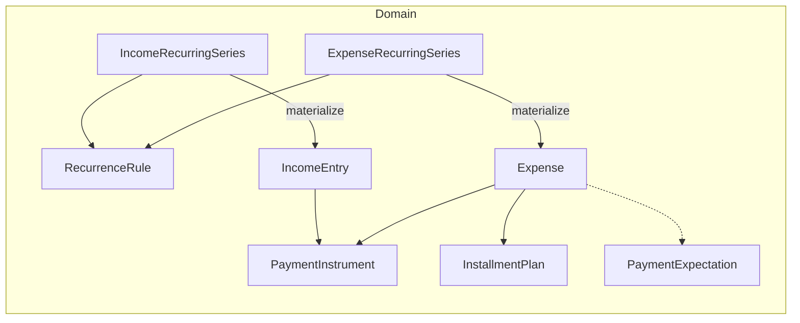

# Phase 4 — Product analysis and domain specification

**Ordered doc:** **`04-phase-4-analysis.md`** — **specification and analysis** for Phase 4 (expanded beyond the narrow line in [`PROJECT_MASTER_PLAN.md`](PROJECT_MASTER_PLAN.md) §6). **Execution tracker:** [`04-implementation-phase-4-plan.md`](04-implementation-phase-4-plan.md).

**Purpose:** Align product intent, domain boundaries, and UX goals for **recurring expenses, income, installments, richer card profiles, and presentation polish**—without implementing here. **Stack:** Flutter, Drift, Riverpod, web-first; **domain** stays free of Flutter/SQLite.

**Commit prefix for implementation:** **`04-`**

---

## 1. Relationship to the master plan and prior phases

| Source | Phase 4 intent |
|--------|----------------|
| [`PROJECT_MASTER_PLAN.md`](PROJECT_MASTER_PLAN.md) §6 | **Recurring + installments** (university / card fee style scenarios). |
| [`PROJECT_MASTER_PLAN.md`](PROJECT_MASTER_PLAN.md) §5.4–5.7 | Installment plans, recurring rules, alerts (alerts largely **Phase 5**), income as future aggregate. **This Phase 4 doc promotes income UI/data into scope.** |
| [`02-reports-and-foundations-phase-2.md`](02-reports-and-foundations-phase-2.md) | **Realized vs scheduled** = `occurredOn` vs local **today** (date-only). Anticipates `ExpenseKind` or **template vs materialized** when recurrence ships. |
| Phase 3 (done) | Card **metadata** profiles, `paymentInstrumentId` on expenses, settings, JSON backup. |

**Expanded Phase 4 (this document):** recurrence engine + confirmation semantics, **income** module, **installments + interest** (basic), **payment instrument** depth (active/default, rates, statement timing), **Home/Reports/form** UX (future-row styling, card label, searchable taxonomy pickers), optional **partial payment** design. **Polish** pass is part of Phase 4 but sequenced late so schema work is not blocked.

---

## 2. Current technical baseline (as of end of Phase 3)

- **Expense:** date-only `occurredOn`, category/subcategory, amounts, FX, `paidWithCreditCard`, `paymentInstrumentId`, description.
- **Scheduled vs realized:** [`ExpenseInclusion`](lib/domain/expense_inclusion.dart) + local calendar; **Home** lists all rows in the month (including future-dated).
- **Category color:** deterministic palette [`category_palette.dart`](lib/domain/category_palette.dart); accent used in [`expense_summary_list_tile.dart`](lib/presentation/expenses/expense_summary_list_tile.dart).
- **Payment instruments:** CRUD in Settings; no `isActive` / `isDefault` in DB (default suggestion uses **SharedPreferences** for “last used” today).

---

## 3. Product goals (consolidated from Phase 4 scope)

1. **Recurring / programmed expenses** — rich recurrence options (calendar-like), optional end date, confirmation / paid-early flows; foundation for alerts in Phase 5.
2. **Income** — register and optionally schedule income (salary, freelance, extras); soft link to investment-related expenses where useful.
3. **UI/UX** — clearer hierarchy, density, professional look; do not sacrifice speed of entry.
4. **Future / scheduled rows** — visually distinct from realized (opacity, tone, typography) with accessibility in mind.
5. **Cards** — fuller lifecycle: active/inactive, default card (single source of truth), statement/due concepts, APR/fees/limit as optional fields; associate with expenses and installments.
6. **Partial payments** — **design and interfaces only** in Phase 4 unless a late optional spike is approved.
7. **Expense form** — category/subcategory colors in pickers, **search** in pickers at scale; **hide** “Paid with credit card” when no usable instruments.
8. **List copy** — show **card label** (e.g. bank + short label) next to “Card”, not generic badge only.
9. **Installments + interest** — when expense is on card, support N-of-M style plans; interest from plan or card profile defaults, with explicit UX (no hidden compounding).

---

## 4. Recurrence: representation strategy

### 4.1 RRULE vs custom sealed model (decision for v1)

| Approach | Pros | Cons |
|----------|------|------|
| **iCalendar RRULE** (subset) | Interop, export to calendar tools, standard vocabulary | Parsing edge cases, testing burden, user mental model mismatch if UI is custom |
| **Custom `RecurrenceRule` sealed types** (Dart) | Matches UI 1:1, easy to validate and test, no external dep | Manual serialization in backup JSON; calendar export later needs mapping |

**Recommendation for v1:** **Custom sealed recurrence model** in **domain** (pure Dart), with **stable JSON encoding** for backup (`schemaVersion` bump when rule shape changes). **Revisit RRULE** as an import/export adapter in Phase 6+ if needed.

### 4.2 Suggested rule variants (non-exhaustive; refine in implementation)

- **Daily** — every `N` days from anchor date.
- **Weekly** — every `N` weeks on selected weekdays.
- **Monthly by calendar day** — day `D` (clamp last day of month if D > month length; document behavior).
- **Monthly by weekday ordinal** — e.g. first/second/third/fourth/last Monday (align with “Google Calendar–like” options).
- **Yearly** — month + day.
- **End condition** — `never` | `untilDate` (date-only) | `afterCount` (optional, if product wants “10 occurrences”).

**Anchor:** first occurrence date (date-only) + timezone policy = **local calendar** (consistent with `occurredOn`).

### 4.3 Materialization strategy (v1)

- **`RecurringSeries` (or `ScheduledExpenseSeries`)** entity holds: template fields (amount pattern, category, default card, recurrence rule, end condition), `seriesId`, maybe `active` flag.
- **Materialization:** generate **concrete `Expense` rows** with future `occurredOn` into the horizon (e.g. next 12 months or configurable window). Regenerate on edit of series (define **replace-forward** vs **touch-only-future** policy in tracker).
- Aligns with existing **scheduled = future date** semantics on Reports/Home.

**Later option:** virtual occurrences + materialize on confirm (heavier; defer unless product insists).

### 4.4 Confirmation, paid early, and “expected” state

- Add **`PaymentExpectationStatus`** (name TBD) on **materialized expense** or small **side table** keyed by `expenseId`:
  - e.g. `expected` (default for generated future), `confirmedPaid`, `skipped`, `waived` (copy in ARB).
- **Paid early:** user may set `confirmedPaid` (and optional `confirmedOn` date) **before** `occurredOn` — allowed.
- **User preference at series creation:** “Assume I will pay on schedule” vs “Ask me to confirm each occurrence” — stores default for generated rows or drives Phase 5 notifications.
- **Phase 4 UI:** minimal — badge on row + action sheet / detail to confirm; **no OS push** until Phase 5.

---

## 5. Income module

### 5.1 Entity shape

- **`IncomeEntry`** (name TBD): `id`, `receivedOn` (date-only), `amount`, `currencyCode`, `manualFxRateToUsd`, `amountUsd`, `description`, optional **`incomeCategory`** or **tags** (enum or free tags — product pick).
- **Types in UX:** salary, freelance, investment return, other — can be **tag** or column `kind`.
- **Recurrence:** reuse same **`RecurrenceRule`** type as expenses; **`IncomeSeries`** mirroring expense series or **generic `CashflowSeries`** with `kind: expense | income` — implementation choice: **parallel tables** for clarity in v1 vs single polymorphic table.

**Recommendation:** **Parallel `Income` + `IncomeRecurringSeries`** (or shared rule embedded in both series tables) to keep queries simple and backup JSON clear.

### 5.2 Investments cross-link

- **v1:** Optional `relatedExpenseId` (last linked expense) or **`externalRef` / tag** string — no double-entry accounting engine.
- **Reports:** optional “investment cashflow” view is **Phase 6+** unless pulled forward explicitly.

### 5.3 Shell / navigation

- New primary destination **Income** (or **Cash flow** with tabs Expenses | Income) — decide in implementation plan; default recommendation: **`/income`** route next to Home.

---

## 6. Payment instruments (Phase 4 depth)

### 6.1 Additional fields (metadata only; no PAN/CVV)

| Field | Purpose |
|-------|---------|
| `isActive` | Hide from pickers when false |
| `isDefault` | **Single** default for new card-paid expenses (app-enforced unique) |
| `statementClosingDay` / `paymentDueDay` | UX + future interest/due alerts |
| `nominalApr` / `monthlyInterestRate` | Optional; pre-fill installment or warning calculators |
| `creditLimit` | Optional display / utilization later |
| `displaySuffix` | e.g. last four — **user-entered label**, not parsed from PAN |

### 6.2 Source of truth for “default card”

- **Recommendation:** **`isDefault` on `PaymentInstrument` row** in Drift; **migrate** away from duplicating default in SharedPreferences for card selection (may keep prefs for “last used” **suggestion** only, or drop if redundant — pick one in 4.4 implementation).

### 6.3 Settings UX

- List all instruments with **active** toggle, **default** radio, edit detail screen for rates/dates.

---

## 7. Installments and interest

### 7.1 Model

- **`InstallmentPlan`:** `id`, `totalPrincipal` (or per-payment amount), `paymentCount`, `startDate`, optional `paymentInstrumentId`, optional **`annualInterestRate`** or fixed **finance charge** (product: simple v1 = equal principal + manual interest field per payment).
- **Child rows:** either **N `Expense` rows** dated per period with `installmentPlanId` + `installmentIndex` **or** separate `InstallmentLeg` table — **prefer linking expenses** for report parity.

### 7.2 UX

- When **paid with credit card** + user chooses installments, create plan and generate or schedule rows.
- **Default APR** from selected **`PaymentInstrument`** if present; user overrides per plan.

### 7.3 Honesty in v1

- Document **formula** (e.g. simple interest vs French system) in UI footnote; avoid silent compounding without disclosure.

---

## 8. Partial payments (design only for Phase 4)

**Concept:** `PartialPayment` records `{ date, amount, currency, targetId, targetType: expense | installmentPlan }` accumulating toward a future or split obligation.

**Phase 4:** Specify **repository interface** + **JSON backup key** placeholder; **implement** only if 4.8 spike is approved.

**Risks:** FX on partials, reconciliation with materialized expenses — Phase 5 **reconciliation** may consume this.

---

## 9. UI/UX themes

### 9.1 Home list — future vs past

- Use `isRealizedOnLocalCalendar(expense.occurredOn, today)` in presentation.
- **Future:** lower opacity **and/or** `ColorScheme.surfaceContainerLow` style background **and/or** “Scheduled” micro-label; ensure **contrast** ≥ WCAG for text.

### 9.2 Expense form

- **Searchable** category/subcategory: `SearchAnchor` / `Autocomplete` with client-side filter.
- **Leading color chip** per category (and optionally subcategory inherits category hue).
- **Hide** card switch if **no active** payment instruments (define: inactive instruments do not count).

### 9.3 List tile — card string

- Resolve `paymentInstrumentId` → `label` / bank; ARB: `expenseListCardWithName` with `{name}`.

### 9.4 Polish pass (late Phase 4)

- Typography scale, spacing tokens, consistent dialogs, empty states — scoped files listed in tracker.

---

## 10. Domain diagram (conceptual)

---

## 11. Risks and mitigations

| Risk | Mitigation |
|------|------------|
| Migration complexity on large books | Backfill series nullable; materialize in batches; tests on web WASM |
| Duplicate materialized rows | Unique constraint `(seriesId, occurredOn)` or idempotent generation |
| User confusion scheduled vs realized | Copy in ARB + filter chip on Home optional |
| Interest correctness | Disclose formula; start with manual amounts per installment |
| Backup JSON drift | Bump `schemaVersion`; migration notes in changelog |

---

## 12. Out of scope for Phase 4

- **Auth, sync, multi-device** (Phase 7).
- **Full alert push notifications** (Phase 5).
- **Bank statement import** (Phase 6+).
- **Budgets** (unless explicitly added).

---

## 13. Phase 5 — what to carry forward

Implement **after** Phase 4 stable:

- **Alert types:** missed recurring confirmation, installment due, scheduled expense tomorrow, FX missing for USD report (from master plan §5.6).
- **Reconciliation dashboard:** sum checks, duplicate suspects, partial payment reconciliation against materialized expenses.
- **Deeper investment** reports using `relatedExpenseId` / tags.
- Optional **RRULE** import/export adapters.

Cross-reference: [`PROJECT_MASTER_PLAN.md`](PROJECT_MASTER_PLAN.md) §6 Phase 5.

---

## 14. Suggested repositories (new interfaces)

- `RecurringExpenseSeriesRepository` / use case layer for materialization.
- `IncomeRepository`.
- `InstallmentPlanRepository` (or fold into `ExpenseRepository` with clear methods).

Keep **domain** free of Drift; **data** implements.

---

## 15. Changelog (this document)

| Date (UTC) | Change |
|------------|--------|
| 2026-03-29 | Initial Phase 4 analysis: recurrence, income, cards v2, installments, UX, partial payment design, Phase 5 bridge. |
